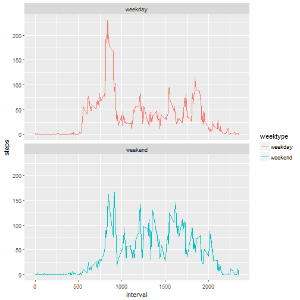

Coursera - Reproducible Research Project 1
==========================================
##Loading and preprocessing the data
###Show any code that is needed to 
###1. Load the data (i.e. read.csv())

```r
setwd("~/R/ReproducibleResearchProject1")
data <- read.csv("activity.csv")
```

###2. Process/transform the data (if necessary) into a format suitable for your analysis

```r
str(data)
```

```
## 'data.frame':	17568 obs. of  3 variables:
##  $ steps   : int  NA NA NA NA NA NA NA NA NA NA ...
##  $ date    : Factor w/ 61 levels "2012-10-01","2012-10-02",..: 1 1 1 1 1 1 1 1 1 1 ...
##  $ interval: int  0 5 10 15 20 25 30 35 40 45 ...
```

```r
head(data)
```

```
##   steps       date interval
## 1    NA 2012-10-01        0
## 2    NA 2012-10-01        5
## 3    NA 2012-10-01       10
## 4    NA 2012-10-01       15
## 5    NA 2012-10-01       20
## 6    NA 2012-10-01       25
```

```r
summary(data)
```

```
##      steps                date          interval     
##  Min.   :  0.00   2012-10-01:  288   Min.   :   0.0  
##  1st Qu.:  0.00   2012-10-02:  288   1st Qu.: 588.8  
##  Median :  0.00   2012-10-03:  288   Median :1177.5  
##  Mean   : 37.38   2012-10-04:  288   Mean   :1177.5  
##  3rd Qu.: 12.00   2012-10-05:  288   3rd Qu.:1766.2  
##  Max.   :806.00   2012-10-06:  288   Max.   :2355.0  
##  NA's   :2304     (Other)   :15840
```

##What is mean total number of steps taken per day?

###For this part of the assignment, you can ignore the missing values in the dataset.

###1. Calculate the total number of steps taken per day

```r
complete <- data[complete.cases(data),]
nrow(complete)
```

```
## [1] 15264
```

```r
str(complete)
```

```
## 'data.frame':	15264 obs. of  3 variables:
##  $ steps   : int  0 0 0 0 0 0 0 0 0 0 ...
##  $ date    : Factor w/ 61 levels "2012-10-01","2012-10-02",..: 2 2 2 2 2 2 2 2 2 2 ...
##  $ interval: int  0 5 10 15 20 25 30 35 40 45 ...
```

```r
summary(complete)
```

```
##      steps                date          interval     
##  Min.   :  0.00   2012-10-02:  288   Min.   :   0.0  
##  1st Qu.:  0.00   2012-10-03:  288   1st Qu.: 588.8  
##  Median :  0.00   2012-10-04:  288   Median :1177.5  
##  Mean   : 37.38   2012-10-05:  288   Mean   :1177.5  
##  3rd Qu.: 12.00   2012-10-06:  288   3rd Qu.:1766.2  
##  Max.   :806.00   2012-10-07:  288   Max.   :2355.0  
##                   (Other)   :13536
```

```r
library(dplyr)
completedaily <- group_by(complete,date)
completedaily <- summarise(completedaily,steps = sum(steps))
print(completedaily)
```

```
## # A tibble: 53 x 2
##          date steps
##        <fctr> <int>
##  1 2012-10-02   126
##  2 2012-10-03 11352
##  3 2012-10-04 12116
##  4 2012-10-05 13294
##  5 2012-10-06 15420
##  6 2012-10-07 11015
##  7 2012-10-09 12811
##  8 2012-10-10  9900
##  9 2012-10-11 10304
## 10 2012-10-12 17382
## # ... with 43 more rows
```
###2. If you do not understand the difference between a histogram and a barplot, research the difference between them. Make a histogram of the total number of steps taken each day


```r
library(ggplot2)
hist1 <- ggplot(completedaily, aes(x = completedaily$steps)) +
        geom_histogram(fill = "blue", binwidth = 1000) +
        labs(title = "Histogram of Steps per day(with NAs)", x = "Steps per day", y = "Frequency")
hist1
```


###3. Calculate and report the mean and median of the total number of steps taken per day


```r
mean(completedaily$steps)
```

```
## [1] 10766.19
```

```r
median(completedaily$steps)
```

```
## [1] 10765
```

##What is the average daily activity pattern?

###1. Make a time series plot (i.e. type = "l") of the 5-minute interval (x-axis) and the average number of steps taken, averaged across all days (y-axis)


```r
completeinterval <- group_by(complete,interval)
completeinterval <- summarise(completeinterval,steps = mean(steps))
ggplot(completeinterval, aes(x=interval, y=steps)) +
  geom_line(color = "black")
```


###2. Which 5-minute interval, on average across all the days in the dataset, contains the maximum number of steps?


```r
maxstep <- max(completeinterval$steps)
completeinterval[completeinterval$steps == maxstep,]
```

```
## # A tibble: 1 x 2
##   interval    steps
##      <int>    <dbl>
## 1      835 206.1698
```


##Imputing missing values

###Note that there are a number of days/intervals where there are missing values (coded as NA). The presence of missing days may introduce bias into some calculations or summaries of the data.

###1. Calculate and report the total number of missing values in the dataset (i.e. the total number of rows with NAs)


```r
sum(is.na(data$steps))
```

```
## [1] 2304
```

###2. Devise a strategy for filling in all of the missing values in the dataset. The strategy does not need to be sophisticated. For example, you could use the mean/median for that day, or the mean for that 5-minute interval, etc.

###3. Create a new dataset that is equal to the original dataset but with the missing data filled in.

####Replace the missing values with the average of that 5-minute interval


```r
newdata <- data
nas <- is.na(newdata$steps)
avg_interval <- tapply(newdata$steps, newdata$interval, mean, na.rm=TRUE, simplify=TRUE)
newdata$steps[nas] <- avg_interval[as.character(newdata$interval[nas])]
sum(is.na(newdata$steps))
```

```
## [1] 0
```


###4. Make a histogram of the total number of steps taken each day and Calculate and report the mean and median total number of steps taken per day. Do these values differ from the estimates from the first part of the assignment? What is the impact of imputing missing data on the estimates of the total daily number of steps?


```r
newdaily <- group_by(newdata,date)
newdaily <- summarise(newdaily,steps = sum(steps))
hist2 <- ggplot(newdaily, aes(x = newdaily$steps)) +
        geom_histogram(fill = "green", binwidth = 1000) +
        labs(title = "Histogram of Steps per day(without NAs)", x = "Steps per day", y = "Frequency")
hist2
```


####Put means & medians together for comparison.


```r
mean <- c(mean(completedaily$steps),mean(newdaily$steps))
median <- c(median(completedaily$steps),median(newdaily$steps))
metrics <- rbind(mean,median)
colnames(metrics) <- c("Data with NAs", "Data w/o NAs")
rownames(metrics) <- c("Mean","Median")
metrics
```

```
##        Data with NAs Data w/o NAs
## Mean        10766.19     10766.19
## Median      10765.00     10766.19
```

####Afer comparison, the most frequent steps/day is higher when missing values are replaced with averages in that interval. And the frequency is increased from about 9 days to 15 days. However, the replacement of missing values didn't change the mean or the mean (the mean is exactly the same while the median has very minimal increase).

##Are there differences in activity patterns between weekdays and weekends?

###For this part the weekdays() function may be of some help here. Use the dataset with the filled-in missing values for this part.

###1. Create a new factor variable in the dataset with two levels - "weekday" and "weekend" indicating whether a given date is a weekday or weekend day.


```r
newdata <- mutate(newdata, weektype = ifelse(weekdays(as.Date(newdata$date)) %in% c("Saturday","Sunday"), "weekend", "weekday"))
newdata$weektype <- as.factor(newdata$weektype)
head(newdata,3)
```

```
##       steps       date interval weektype
## 1 1.7169811 2012-10-01        0  weekday
## 2 0.3396226 2012-10-01        5  weekday
## 3 0.1320755 2012-10-01       10  weekday
```


###2. Make a panel plot containing a time series plot (i.e. type = "l") of the 5-minute interval (x-axis) and the average number of steps taken, averaged across all weekday days or weekend days (y-axis). See the README file in the GitHub repository to see an example of what this plot should look like using simulated data.


```r
weekinterval <- group_by(newdata,.dots=c("interval","weektype"))
weekinterval <- summarise(weekinterval,steps = mean(steps))
head(weekinterval)
```

```
## # A tibble: 6 x 3
## # Groups:   interval [3]
##   interval weektype      steps
##      <int>   <fctr>      <dbl>
## 1        0  weekday 2.25115304
## 2        0  weekend 0.21462264
## 3        5  weekday 0.44528302
## 4        5  weekend 0.04245283
## 5       10  weekday 0.17316562
## 6       10  weekend 0.01650943
```

```r
hist3 <- ggplot(weekinterval, aes(x=interval, y=steps, color = weektype)) +
  geom_line() +
  facet_wrap(~weektype, ncol = 1, nrow=2)
print(hist3)
```



####There are obvious differences between weekdays and weekends. During weekdays, the person becomes active earlier in the day. However, later in the day, the person on average is more active during weekends than weekdays.
